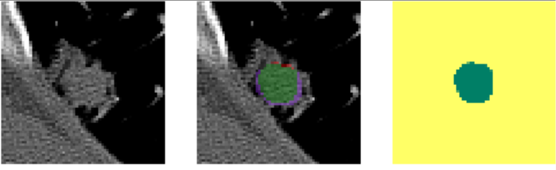

# CT Segmentation
 All kinds of models and scripts for data processing and visualizations.


## Environment
Python3.12 is recommended. Libraries are managed by https://python-poetry.org/

After installing poetry, run this to start poetry venv:
```commandline
poetry install
```

Create a jupyter kernel from venv:
```commandline
poetry run python -m ipykernel install --user --name ctseg-py3.12
```

To edit or remove kernels:
```commandline
jupyter kernelspec list
jupyter kernelspec remove KERNEL_NAME
```
## Segmentation with 2D BBox Prompt
Training: `notebook/2d_box_seg.ipynb`


* Green: true positive
* Red: false positive
* Purple: false negative

### Dataset
DeepLesion 3D subset of the ULS23 dataset
* 743 3D lesion segmentations
* 4538 2D slices
* train/val split done by lesions to avoid data leakage


## Video Generation
### AutoPET
[Dataset](https://uppsala.app.box.com/folder/286456299982?s=t33kcqjifp0q23fv2zf0i58sz8njxcd7)
that we are labeling and reviewing (2024-2025).

Script: `notebooks/ct_video.ipynb`

## ULS23
* Download all 6 .zip parts files from https://github.com/DIAGNijmegen/ULS23/
* Unzip all 6 parts such that they are in the same folder 
  * The folder should contain fragmented zip files (.z01, .z02, ...) for all 6 parts
* Unzip the fragmented zip files

```commandline
sudo apt update
sudo apt install p7zip-full

7z x ULS23_Part1.zip
7z x ULS23_Part2.zip
...
```

Labels in git repo - merge the label folder with the existing `ULS23` data folder.


